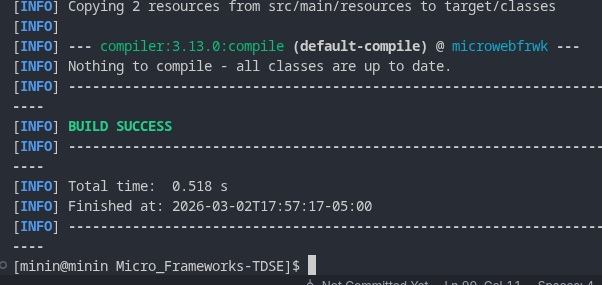
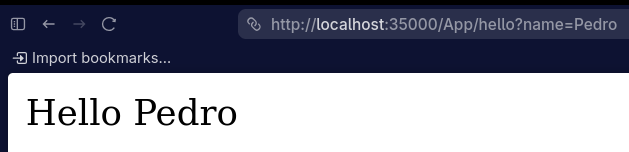
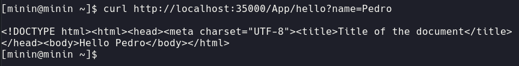
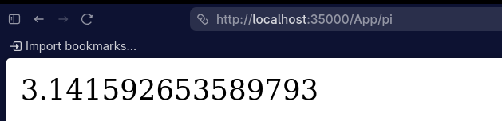
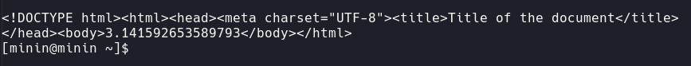
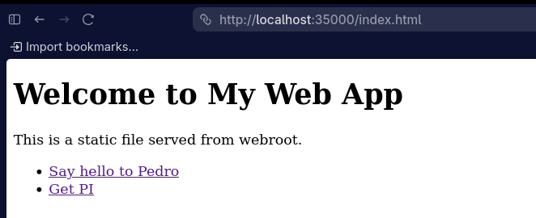
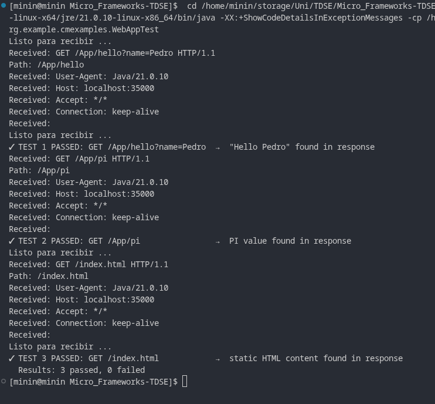

# Micro Web Framework — TDSE

## Juan Pablo Contreras Parra

A lightweight, dependency-free HTTP web framework in Java.  

---

## Table of Contents

1. [Project Overview](#1-project-overview)
2. [Architecture](#2-architecture)
3. [Project Structure](#3-project-structure)
4. [Prerequisites & Building](#4-prerequisites--building)
5. [Running the Example Application](#5-running-the-example-application)
6. [Framework API Reference](#6-framework-api-reference)
7. [Example Application — WebApp](#7-example-application--webapp)
8. [Automated Functional Test — WebAppTest](#8-automated-functional-test--webapptest)
9. [Tests Performed & Results](#9-tests-performed--results)
10. [Architecture Diagrams](#10-architecture-diagrams)

---

## 1. Project Overview

This project was built as part of the TDSE course to explore how micro web frameworks work internally.  
The result is a self-contained Java server that:

- Accepts raw TCP connections and speaks HTTP/1.1
- Routes incoming GET requests to registered handler lambdas
- Serves static files from the classpath
- Supports optional URL path prefixes for REST API grouping


---

## 2. Architecture

### Core Components

| Class | Role |
|---|---|
| `HttpServer` | The server core. Binds port 35000, reads HTTP requests, dispatches to routes or static files. |
| `Route` | Functional interface. Receives a `Request` and `Response`, returns a `String` body. |
| `WebMethod` | Simpler functional interface for parameterless handlers (no request/response needed). |
| `Request` | Holds the parsed query parameters of the incoming request. |
| `Response` | Placeholder for future response manipulation (status codes, headers, etc.). |
| `WebApp` | Example application — shows how a developer builds on the framework. |
| `WebAppTest` | Automated functional test — starts the server and validates all endpoints with real HTTP calls. |

### Supporting / Exploratory Classes

| Class | Role |
|---|---|
| `EchoServer` | Raw TCP echo server — the foundational socket experiment this project evolved from. |
| `EchoClient` | Raw TCP client to interact with `EchoServer`. |
| `URLParser` | Demonstrates how Java's `URL` class parses each component of a URL. |
| `URLReader` | Demonstrates how to open a URL connection and read response headers and body. |

---

## 3. Project Structure

```
Micro_Frameworks-TDSE/
├── pom.xml
└── src/
    └── main/
        ├── java/
        │   └── org/example/
        │       ├── Main.java                        ← default IntelliJ entry point
        │       ├── utilities/
        │       │   ├── HttpServer.java              ← framework core
        │       │   ├── Route.java                   ← handler interface
        │       │   ├── WebMethod.java               ← simple handler interface
        │       │   ├── Request.java                 ← request abstraction
        │       │   ├── Response.java                ← response abstraction
        │       │   ├── EchoServer.java              ← raw TCP server (exploratory)
        │       │   ├── EchoClient.java              ← raw TCP client (exploratory)
        │       │   ├── URLParser.java               ← URL parsing demo
        │       │   └── URLReader.java               ← URL reading demo
        │       └── cmexamples/
        │           ├── HelloWebApp.java             ← early example
        │           ├── WebApp.java                  ← main example application
        │           └── WebAppTest.java              ← automated functional test
        └── resources/
            └── webroot/
                └── index.html                       ← static file served at /index.html
```

---

## 4. Prerequisites & Building

**Requirements:**
- Java 21+
- Maven 3.6+

**Build:**

```bash
mvn compile
```

**Clean build:**

```bash
mvn clean compile
```



---

## 5. Running the Example Application

Run `WebApp` as the main class:

**From IntelliJ IDEA:**  
Right-click `WebApp.java` → *Run 'WebApp.main()'*

**From the terminal:**

```bash
mvn compile
mvn exec:java -Dexec.mainClass="org.example.cmexamples.WebApp"
```

The server starts on **port 35000**. You will see:

```
Listo para recibir ...
```

Then open a browser or use `curl`:

| Request | Expected Response |
|---|---|
| `http://localhost:35000/App/hello?name=Pedro` | HTML page with `Hello Pedro` in the body |
| `http://localhost:35000/App/pi` | HTML page with `3.141592653589793` in the body |
| `http://localhost:35000/index.html` | The static `index.html` page |









---

## 6. Framework API Reference

### `HttpServer.staticfiles(String location)`

Sets the classpath directory from which static files are served.

```java
staticfiles("/webroot");
// A request for /index.html will load /webroot/index.html from the classpath.
```

### `HttpServer.path(String prefix)`

Sets a URL prefix that is automatically prepended to every route registered after this call.

```java
path("/App");
get("/hello", ...);  // registers as /App/hello
```

### `HttpServer.get(String path, Route handler)`

Registers a GET route with full access to the request and response.

```java
get("/hello", (req, resp) -> "Hello " + req.getValues("name"));
```

### `HttpServer.get(String path, WebMethod handler)`

Registers a GET route with a simple no-argument lambda.

```java
get("/time", () -> LocalTime.now().toString());
```

### `HttpServer.start()`

Starts the server loop (blocking). Call after all routes are registered.

```java
start();
```

### `Request.getValues(String key)`

Returns the value of a query parameter by name.

```java
// For the URL /hello?name=Pedro
req.getValues("name");  // returns "Pedro"
```

---

## 7. Example Application — WebApp

`WebApp.java` shows how a developer would build an application on this framework.  
It registers two REST endpoints and enables static file serving:

```java
public static void main(String[] args) throws IOException, URISyntaxException {
    staticfiles("/webroot");       // serve files from src/main/resources/webroot/
    path("/App");                  // prefix all routes with /App

    get("/hello", (req, resp) -> "Hello " + req.getValues("name"));

    get("/pi", (req, resp) -> {
        return String.valueOf(Math.PI);
    });

    start();
}
```

The resulting endpoints are:

```
GET http://localhost:35000/App/hello?name=<value>  →  "Hello <value>"
GET http://localhost:35000/App/pi                  →  "3.141592653589793"
GET http://localhost:35000/index.html              →  static HTML file
```

---

## 8. Automated Functional Test — WebAppTest

`WebAppTest.java` is a self-contained functional test that:

1. Registers the same routes as `WebApp`
2. Starts `HttpServer` on a **daemon thread** (so the JVM exits automatically after the test)
3. Waits 500 ms for the server to be ready
4. Issues three real HTTP GET requests using `HttpURLConnection`
5. Validates each response and prints a clear pass/fail result

**Run it the same way as the app:**

*From IntelliJ IDEA:* Right-click `WebAppTest.java` → *Run 'WebAppTest.main()'*

*From the terminal:*

```bash
mvn exec:java -Dexec.mainClass="org.example.cmexamples.WebAppTest"
```

**Expected console output:**

```
Listo para recibir ...
✓ TEST 1 PASSED: GET /App/hello?name=Pedro  →  "Hello Pedro" found in response
Listo para recibir ...
✓ TEST 2 PASSED: GET /App/pi                →  PI value found in response
Listo para recibir ...
✓ TEST 3 PASSED: GET /index.html            →  static HTML content found in response

─────────────────────────────────────────
  Results: 3 passed, 0 failed
─────────────────────────────────────────
```



---

## 9. Tests Performed & Results

### Test 1 — GET route with query parameter

**What is tested:** The framework correctly parses a query string from the URL and passes the value to the route handler.

| | |
|---|---|
| **Request** | `GET http://localhost:35000/App/hello?name=Pedro` |
| **Expected** | Response body contains `Hello Pedro` |
| **How validated** | `WebAppTest` checks `response.contains("Hello Pedro")` |


---

### Test 2 — GET route with computed response

**What is tested:** The framework executes the lambda, captures the return value, and wraps it in a valid HTTP response.

| | |
|---|---|
| **Request** | `GET http://localhost:35000/App/pi` |
| **Expected** | Response body contains `3.141592653589793` |
| **How validated** | `WebAppTest` checks `response.contains(String.valueOf(Math.PI))` |


---

### Test 3 — Static file serving

**What is tested:** The framework loads `index.html` from the classpath resource directory `/webroot` and returns it as the response body.

| | |
|---|---|
| **Request** | `GET http://localhost:35000/index.html` |
| **Expected** | Response body contains `Welcome to My Web App` |
| **How validated** | `WebAppTest` checks `response.contains("Welcome to My Web App")` |


---